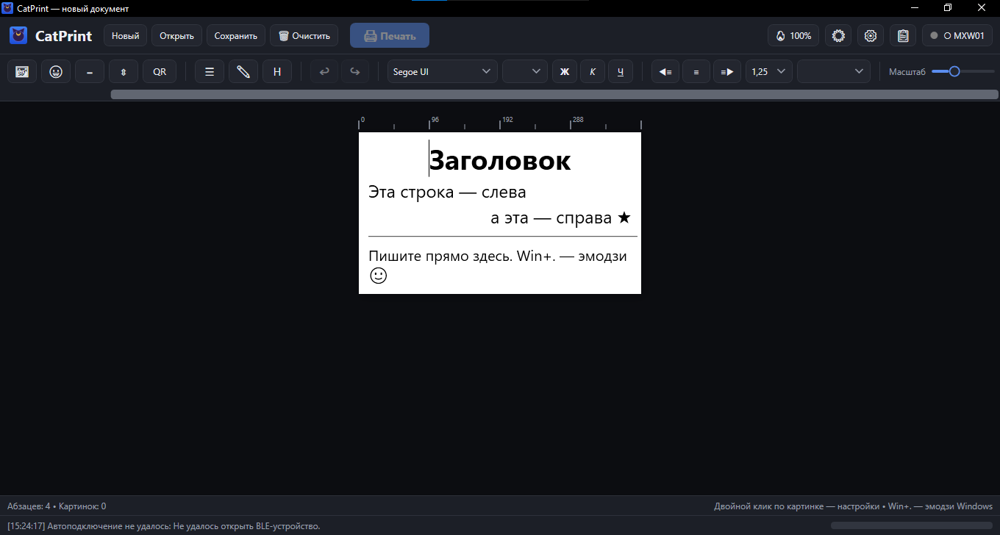

# CatPrint

Десктопный редактор и печать на термопринтер MXW01 (BLE) — Windows, WPF, .NET 8.



## Возможности
- Редактор документов: текст (шрифты, Ж/К/Ч, выравнивание), картинки, QR-коды, эмодзи.
- Формат `.catdoc` v2 — общий с [мобильной версией (CatPrint Android)](https://github.com/SaymonRen-ui/catprint-android): файлы открываются там и там.
- Печать по BLE: протокол MXW01 (A1/A2/A9/AD, CRC8), растр 384 точки, строка 48 байт одним ATT-write.
- 10 режимов дизеринга (Флойд–Стейнберг, Аткинсон, Байер 4×4/8×8, Джарвис, Стуки, Берк, Сьерра, порог, случайный).
- Фото-пайплайн, контроль нагрева (интенсивность/адаптив), рамки, копии.
- Тёмная и светлая темы, настройки в `%AppData%/CatPrint/settings.json`.

## Запуск из исходников
Требуется .NET 8 SDK (Windows, нужен Bluetooth LE).

```powershell
dotnet run --project src/CatPrint/CatPrint.csproj
```

## Сборка установщика
```powershell
dotnet publish src/CatPrint/CatPrint.csproj -c Release -r win-x64 --self-contained -o publish/standalone
# затем открыть installer/CatPrint.iss в Inno Setup 6 и скомпилировать
# → installer-output/CatPrint-Setup-1.0.0.exe
```

Готовый установщик лежит в Releases.

## Структура
- `src/CatPrint/Views` — окна: редактор, принтер, настройки, QR, эмодзи, лог.
- `src/CatPrint/Imaging` — растр 384px, дизеринги, фото-пайплайн, нагрев.
- `src/CatPrint/Printing` — протокол MXW01, BLE-подключение, сервис печати.
- `installer/CatPrint.iss` — сценарий Inno Setup 6.
